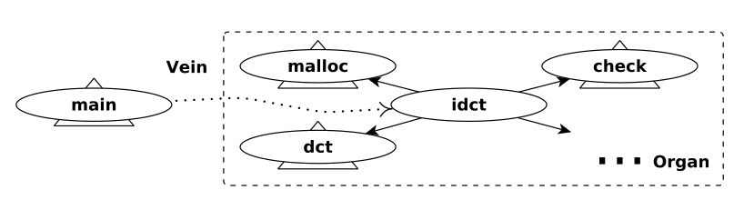

# Automated Software Transplantation

## Overview

Automated transplantation would open many exciting avenues for software
development: suppose we could autotransplant code from one system into
another, entirely unrelated, system. This paper introduces a theory,
algorithm, and tool that achieve this. Leveraging lightweight annotation,
program analysis identifies an organ (interesting behavior to transplant);
testing validates that the organ exhibits the desired behavior during its
extraction and after its implantation into a host. While we do not claim
automated transplantation is now a solved problem, our results are
encouraging: we report that in 12 of 15 experiments, involving 5 donors
and 3 hosts (all popular real-world systems), we successfully autotransplanted
new functionality and passed all regression tests. Autotransplantation is
also already useful: in 26 hours computation time we successfully
autotransplanted the H.264 video encoding functionality from the x264
system to the VLC media player; compare this to upgrading x264 within
VLC, a task that we estimate, from VLC’s version history, took human
programmers an average of 20 days of elapsed, as opposed to dedicated, time.

## The μTrans Approach

The figures below shows the overall architecture of the μTrans approach to
the software transplantation problem. Given an organ’s entry point Ol and
TDO, a test suite that exercises O’s behaviour, μTrans progressively “evolves”
O and V by adding code along a path (a vein) from donor start to Ol. The search
space of possible organ veins is enormous, consisting of all combinations of
all valid statements and variables of the desired functionality in the donor
and host. To explore this search space efficiently, we therefore separate our
approach into two stages.

<figure>

<figcaption>
Figure 1: The call graph identifying the vein and the organ. The wavy line
is the vein; main is the donor’s entry point; idct is the organ’s entry;
the rest of the nodes are on the forward slice. A triangle behind a
node suggests subgraphs reachable from that node.
</figcaption>
</figure>

In the first, organ-extraction stage, we employ static analysis to slice out
an initial, conversative over-approximation of the organ and one of its veins.
In the second, organ implantation stage, we apply genetic programming, using
the donor’s test suite, against the reduced search space produced by the first
phase to evolve the organ and its vein to fit the “ecosystem” defined by LH ,
the insertion context in the host. The third stage implants the organ into
the beneficiary automatically. Finally, we apply additional testing to
validate the correctness of the transplanted host.

<figure>
  
  <figcaption>
    Figure 2: Overall architecture of μTrans; an SDG is a system dependency
    graph that the genetic programming phase uses to constrain its search space.
  </figcaption>
</figure>
